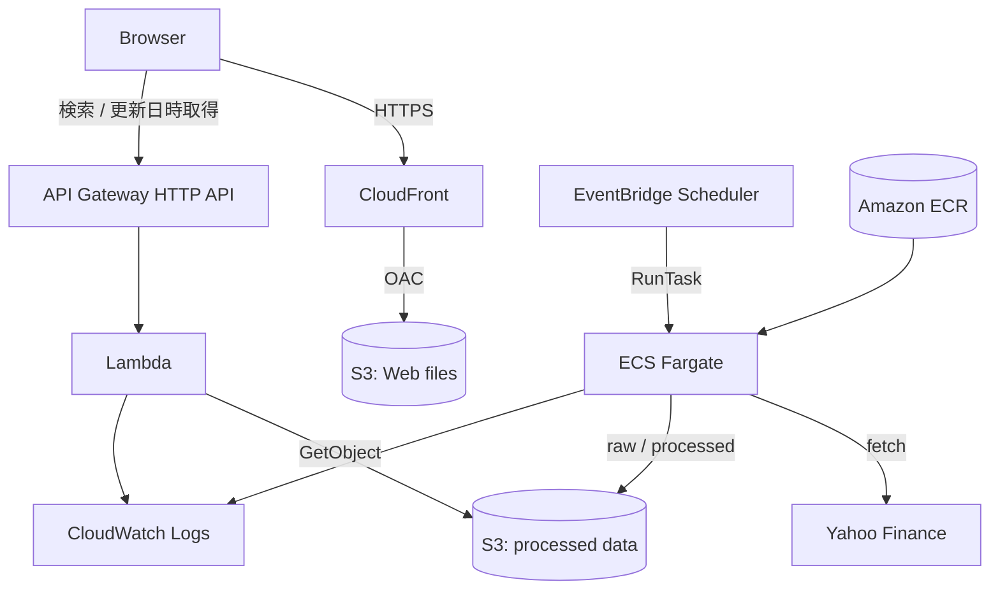

# Stock Compass — 米国株スクリーナー

財務指標とテクニカル指標を組み合わせて、米国株を検索できるWebアプリケーションです。
約6,000銘柄のデータ取得を長時間バッチ、検索処理をサーバーレスAPIへ分離し、
低コストで運用できるAWS構成にしました。

## 公開サイト

**[Stock Compassを開く](https://d2cpxcfx5oy0g3.cloudfront.net/)**

AWS上で稼働している公開環境です。静的フロントエンドはCloudFront経由で配信し、
検索リクエストはAPI GatewayとLambdaで処理します。

> データはリアルタイムではなく月次更新です。学習・情報提供を目的としたアプリであり、
> 投資判断を推奨するものではありません。

## アプリケーション概要

時価総額、PER、PBR、ROE、EPS成長率などのファンダメンタル指標に加え、
RSI、移動平均線、52週高値からの乖離、トレンド判定で銘柄を絞り込めます。

データ取得とWeb検索を同じ処理にせず、次の2つへ分離しています。

- **データ更新:** EventBridge SchedulerからECS Fargateのバッチを月次実行
- **スクリーニング:** S3の加工済みJSONをLambdaで読み、API Gateway経由で即時検索

この分離により、Yahoo Financeへのアクセスや重い指標計算をユーザーの検索ごとに
実行せず、Web APIの応答時間と外部サービスへの負荷を抑えています。

## 主な機能

### データ収集・加工

- NASDAQ、NYSE、AMEXの銘柄一覧を取得
- ETF、テスト銘柄、ワラント、ユニット、ライツなどを取得対象から除外
- 基本情報、年次・四半期財務諸表、1年分の株価履歴を取得
- PER、PBR、配当利回り、ROE、ROA、FCF利回りなどを計算
- 年次EPSからCAGRと連続増加年数を計算
- RSI、SMA、MACD、ボリンジャーバンド、52週高値・安値との位置を計算
- 1銘柄ごとにrawデータを保存し、中断後の再開に対応
- 欠損データの検証と、銘柄単位のエラー分離

### Webスクリーニング

- ファンダメンタル・テクニカル条件の組み合わせ検索
- セクターの指定・除外
- 結果の並べ替えとレスポンシブ表示
- Yahoo Financeの銘柄ページへのリンク
- 入力値検証、ローディング表示、タイムアウト・APIエラー表示
- 検索条件をブラウザのlocalStorageへ名前付きで保存・復元
- 各指標へマウスを重ねた際に説明を表示
- ECSバッチが更新した株式データの最終更新日時を表示

## システム構成



### AWSサービスの役割

| サービス | 用途 |
|---|---|
| CloudFront | HTTPS配信、キャッシュ、非公開S3へのOACアクセス |
| S3 | 静的Webファイルと株式データを別バケットで保存 |
| API Gateway | `POST /screen`を公開し、CORSとスロットリングを設定 |
| Lambda | 加工済みデータを読み込んで条件判定 |
| EventBridge Scheduler | 月次バッチを起動 |
| ECS Fargate | Yahoo Financeからの長時間データ取得・加工 |
| ECR | バッチ用Dockerイメージを保存 |
| CloudWatch Logs | LambdaとFargateの実行ログを集約 |
| IAM | Task Role、Execution Roleなどを用途別に分離 |

常駐サーバー、ECS Service、ALB、NAT Gateway、RDSは使用していません。
バッチ実行時だけFargateを起動し、検索はLambdaで処理する構成です。

## 技術スタック

| 分類 | 技術 |
|---|---|
| Backend | Python 3.12, pandas, NumPy, yfinance, pandas-ta |
| Frontend | HTML, CSS, Vanilla JavaScript |
| Container | Docker |
| AWS | ECS Fargate, ECR, EventBridge Scheduler, Lambda, API Gateway, S3, CloudFront, CloudWatch, IAM |
| Test | unittest, unittest.mock |

依存バージョンは`requirements.lock`に固定しています。

## 設計上の工夫

### 1. 長時間バッチとオンライン検索の分離

全銘柄の外部データ取得には長時間かかる一方、画面検索には短い応答時間が必要です。
そこでFargateが指標を事前計算した`processed/stocks.json`を作成し、Lambdaはその
ファイルだけを検索します。LambdaからYahoo Financeへは接続しません。

### 2. 途中保存による再開性

取得成功直後に`raw/<ticker>.pkl`を保存します。バッチが途中で停止しても、再実行時は
有効期間内の正常なrawをスキップし、未取得・期限切れ・不完全な銘柄だけを取得します。
`--force`を指定すれば全件更新も可能です。

### 3. レート制限と障害の局所化

Yahoo Financeへの高レベル呼び出しは既定で60回/分に制限し、429発生時は指数
バックオフで再試行します。1銘柄の失敗でバッチ全体を停止せず、次の銘柄へ進みます。

### 4. 保存先を抽象化

`common/storage.py`でローカルファイルとS3を同じインターフェースにしています。
ビジネスロジックを変更せず、環境変数だけでローカル実行とAWS実行を切り替えられます。

### 5. セキュリティとコスト

- AWS認証情報をコードやDockerイメージへ埋め込まず、IAM Roleを使用
- Web用S3は公開せず、CloudFront OACからのみ読み取り可能
- API GatewayにCORSとスロットリングを設定
- フロントエンドにContent Security Policyを設定
- 必要なときだけFargateを起動するサーバーレス中心の構成

## 動作実績

2026年8月にAWS上でフル取得を実行し、次の結果を確認しました。

```text
取得成功: 5,688銘柄
取得失敗:   542銘柄
processed/stocks.json: 5,688銘柄
Fargate終了コード: 0
```

失敗銘柄が存在しても成功データから加工済みファイルを生成し、処理全体を完了します。
少数銘柄、100銘柄、全銘柄の順に段階的な動作確認を行いました。

## データ構造

ローカルとS3で同じ相対キーを使用します。

```text
data/ または s3://<bucket>/<prefix>/
├── raw/
│   ├── AAPL.pkl
│   ├── MSFT.pkl
│   └── ...
└── processed/
    └── stocks.json
```

- `raw`: yfinanceが返す辞書やDataFrameを銘柄単位で保存する再処理用データ
- `processed`: Lambdaが追加計算なしで検索できる標準JSON

pickleは、本バッチが生成した信頼できるファイルだけを読み込む前提です。

## ローカルでの実行

### 必要な環境

- Python 3.12
- Docker（Docker実行を確認する場合）

### セットアップ

```bash
git clone https://github.com/yoheiyamashita1015/stock_screener.git
cd stock_screener
python3 -m venv .venv
source .venv/bin/activate
python -m pip install --upgrade pip
python -m pip install -r requirements.lock
```

### 少数銘柄を取得

```bash
STORAGE_MODE=local python -m src.fetch --tickers AAPL,MSFT
```

保存済みrawから加工済みJSONだけを再生成する場合：

```bash
STORAGE_MODE=local python -m src.fetch --process-only
```

保存済みデータをCLIでスクリーニングする場合：

```bash
STORAGE_MODE=local python -m lambda_app.screen \
  --conditions '{"min_market_cap":1000000000,"max_per":50,"min_roe":10}'
```

### Web画面を起動

```bash
python3 -m http.server 8080 --directory web
```

ブラウザで`http://localhost:8080`を開きます。ローカル画面からAWS APIを呼ぶ場合は、
API GatewayのCORSで`http://localhost:8080`を許可する必要があります。

## Dockerでの実行

```bash
docker build -t stock-screener-batch .
mkdir -p data
docker run --rm \
  -e STORAGE_MODE=local \
  -e LOG_LEVEL=INFO \
  -v "$(pwd)/data:/app/data" \
  stock-screener-batch \
  --tickers AAPL,MSFT
```

コンテナのENTRYPOINTは`python -m src.fetch`です。処理終了後にコンテナも終了します。

## テスト

```bash
python -m unittest discover -s tests -v
```

現在の単体テストでは、主に以下を検証しています。

- 必須データが不足したrawの拒否
- 正常なrawの受け入れと中断後の再取得
- EPS成長率と配当利回りの計算
- ワラント、ユニット、ライツの除外
- yfinanceキャッシュの保存場所
- Lambdaの検索レスポンスと軽量な更新日時取得

## 主な環境変数

| 変数 | 既定値 | 用途 |
|---|---:|---|
| `STORAGE_MODE` | `local` | `local`または`s3` |
| `LOCAL_DATA_DIR` | `data` | ローカル保存先 |
| `S3_BUCKET_NAME` | なし | S3モードで使用するデータバケット |
| `S3_PREFIX` | `stock-screener` | S3内の共通プレフィックス |
| `TICKER_FILE` | なし | ticker一覧のテキストまたはCSV |
| `YAHOO_MAX_REQUESTS_PER_MINUTE` | `60` | 高レベル呼び出し上限（回/分） |
| `REQUEST_DELAY_SECONDS` | `1.0` | 呼び出しの最小開始間隔 |
| `REQUEST_JITTER_SECONDS` | `0` | 待機時間へ加えるランダム値 |
| `RAW_MAX_AGE_HOURS` | `672` | rawを再利用する期間（28日） |
| `RETRY_MAX_ATTEMPTS` | `3` | レート制限時の最大試行回数 |
| `RETRY_WAIT_SECONDS` | `60` | 最初のリトライ待機秒数 |
| `LOG_LEVEL` | `INFO` | ログレベル |

## ディレクトリ構成

```text
.
├── common/                    # local/S3共通の保存層・設定
├── lambda_app/                # オフライン検索ロジックとLambdaハンドラー
├── src/                       # 取得、検証、指標計算、加工バッチ
├── tests/                     # 単体テスト
├── web/                       # HTML/CSS/JavaScriptフロントエンド
├── Dockerfile
└── requirements.lock
```

## 現在の制約と今後の改善

- Yahoo Finance側の仕様変更やレート制限により、一部銘柄の取得が失敗する可能性がある
- 株価と財務データは現在まとめて月次更新しており、リアルタイム価格ではない
- APIは認証なしのため、一般公開での継続運用を想定する場合はAmazon Cognitoなどの認証を検討する
- AWSリソースは手動構築のため、CloudFormationやTerraformによるIaC化を検討する
- CIでの自動テスト、依存関係スキャン、デプロイ自動化を追加する
- 取得成功率とバッチ失敗をCloudWatch Alarmで通知する

## 開発の背景

ローカルで作成したStreamlit版を出発点に、長時間処理、再実行、障害分離、権限管理、
低コスト運用を考慮したAWSアプリケーションへ段階的に再設計しました。単にAWSへ
配置するのではなく、バッチ処理とオンライン処理の特性に合わせてサービスを分け、
ローカルでも検証可能な構成を維持することを重視しています。
